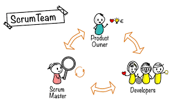

# Agile and Scrum 

### Agile 

Agile is the ability to create and respond to change. it use's scrum, extereme porgraming 
or feature driven development.

### How does agile fit into DevOps

DevOps is a culture, maintaining collaboration amongst all participants involved in the development and maintenance of software. Agile can be described as a development methodology designed to maintain productivity and drive releases with the common reality of changing needs.

### 4 Agile Values 

- individuals and intercalation over processes and tools 
- Working software over comprehensive documentation 
- Customer collaboration over contract negotiation 
- Responding to change over following a plan 

### 12 Agile principles 

1.	Our highest priority is to satisfy the customer through the early and continuous delivery of valuable software.
2.	Welcome changing requirements, even late in development. Agile processes harness change for the customer’s competitive advantage.
3.	Deliver working software frequently, from a couple of weeks to a couple of months, with a preference to the shorter timescale.
4.	Business people and developers must work together daily throughout the project.
5.	Build projects around motivated individuals. Give them the environment and support they need and trust them to get the job done.
6.	The most efficient and effective method of conveying information to and within a development team is face-to-face conversation.
7.	Working software is the primary measure of progress.
8.	Agile processes promote sustainable development. The sponsors, developers, and users should be able to maintain a constant pace indefinitely.
9.	Continuous attention to technical excellence and good design enhances agility.
10.	Simplicity–the art of maximizing the amount of work not done–is essential.
11.	The best architectures, requirements, and designs emerge from self-organizing teams.
12.	At regular intervals, the team reflects on how to become more effective, then tunes and adjusts its behavior accordingly.

### what is the difference between agile and traditional models 

- traditional models use the waterfall method where they start planning then creating and once everything is created then they review it to be released. this is highly inefficient, as there could be many issues in the build however they cant find out if there are problems till it has all be reviewed. Agile makes this process much quicker and efficient as all everyone on the team is working at the same time so you can check whether it is working in the same day instead of having to wait weeks between releases. 

### Scrum 

scrum is a tool used by software developers and scrum masters to track the progress and for complete transparency of the development progress. 

### The benefits of scrum 

### Scrum teams 

within scrum there is specific team this consists of the Product owner who knows what the customer wants and the relative buisness values of those wants. They can translate these needs back to the scrum team, scrum master helps to keep the team accountable to their commitments to the business and remove any roadblocks that might halt productivity and developers are structured and empowered by the organisation and manage their own work. The resulting synergy optimizes the development team's overall efficiency.

### The three pillars of scrum 

- First pillar- transparency, in this the whole team has to be transparent with what they are working on and how they are doing so that the whole team is on the same page and not working at different speeds.
- Second pillar- inspection, this is where the team can inspect what each other are doing and help out where it might be needed and give feedback on the weeks tasks.
- Third pillar- adaptation, in the world of DevOps your task will consistency be changing to meet the needs of the client s oyou have to be able to adapt to the ever-changing environment 

