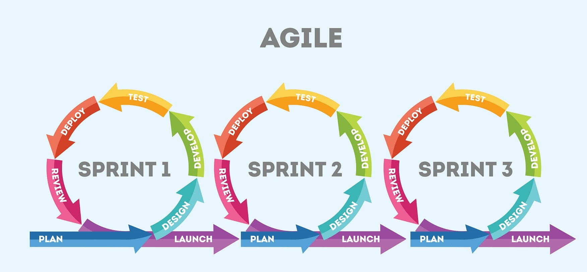

# Agile and Scrum 

- Agile 

Agile is the ability to create and respond to change. it use's scrum, extereme porgraming 
or feature driven development.

-scrum 

scrum is a tool used by software developers and scrum masters to track the progress and all w for complete transparency of the development progress. 

